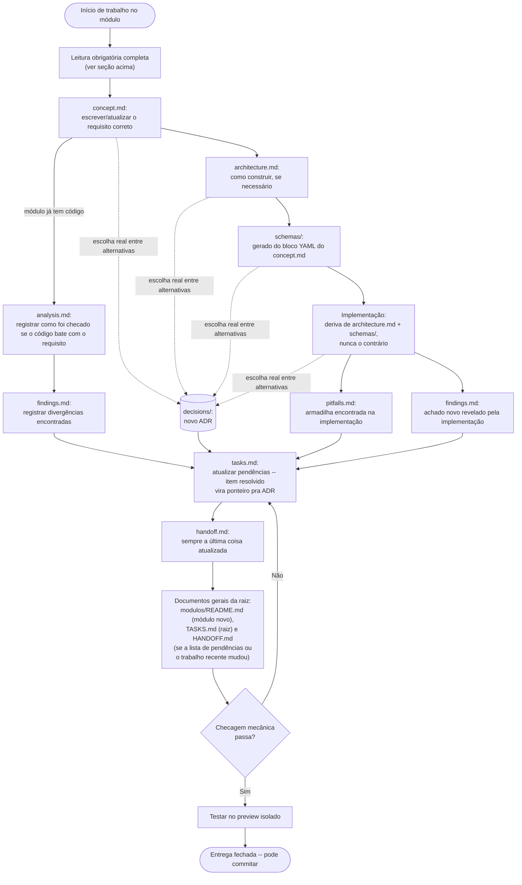

# CLAUDE.md

Este documento bem como todos os citados nele devem ser lidos na íntegra, sem ferramentas de resumo, sem cortes, sem negociação

Instruções para o Claude Code neste repositório.
Todas as leituras sugeridas nesse documento devem ser feitas na íntegra, sem ferramentas de 

> Nos passos a seguir "você" se refere à ferramenta CLAUDE, "eu" se refere a quem está desenvolvendo o sistema com utilização da ferramenta

- Entender o projeto a partir da leitura de [Conceito Geral](<../docs/docs-VMODEL-visao-geral/1 - documento-de-conceito-geral.md>)
- LER [prompt model](<../docs/prompt model.txt>)

> Para este projeto apenas os documentos 1 e 2 aqui
[DOCS](../docs/docs-VMODEL-visao-geral) não seguem um padrão especificado

## Fonte de verdade

Ver `HANDOFF.md` primeiro -- só aponta pro módulo certo, nunca
contém detalhe. Ver `TASKS.md` (raiz) pras pendências, mesma regra: só
aponta. Ver `modulos/README.md` pro índice completo dos módulos, o
fluxo de trabalho e a convenção de escrita.

## Leitura obrigatória antes de qualquer alteração

Regra geral, sem fronteira de seção -- vale pra qualquer leitura, em
qualquer momento do trabalho, não só a lista abaixo: nenhuma saída
parcial substitui ler o conteúdo inteiro -- resultado de busca por
padrão, trecho com contexto cortado, prévia, paginação, corte por
tamanho, resumo gerado por qualquer ferramenta ou por outro agente,
lembrança de leitura anterior. A regra é sobre a forma do resultado
(parcial ou completo), não sobre qual ferramenta específica produziu
ele -- vale pra qualquer mecanismo, presente ou futuro, que devolva
menos que o conteúdo inteiro. Busca por padrão só serve pra uma coisa
-- checagem de existência (essa string aparece em algum lugar, sim ou
não) -- nunca pra confirmar o que uma seção diz ou decidir se uma
regra bate. Teste prático: depois de "ler" um documento, devia ser
possível citar qualquer trecho dele, não só o que apareceu numa busca
-- se isso só é possível reabrindo o arquivo, a leitura anterior não
foi completa.

Ordem de leitura, nessa sequência, sempre:

1. Arquivos de memória pessoal (fora da pasta do projeto) -- não uma
   eventual pasta de memória vazia dentro do próprio projeto; a
   memória de verdade fica associada à sessão/usuário, não ao
   repositório. Memória é retrato de um momento, não fato vivo --
   checar contra o estado real do repositório antes de tratar
   qualquer coisa lida ali como verdade atual.
2. `HANDOFF.md` e `TASKS.md` (raiz), depois `modulos/README.md`
   completo (índice de módulos, fluxo de trabalho, e a seção "Como
   escrever" -- fonte única do formato de todo documento do sistema).
3. `handoff.md` e `concept.md` completos do módulo da área que for
   mexer (não só a seção que parece relevante).
4. `modulos/_template/` completo -- todos os arquivos-modelo dentro de
   `docs/` (`concept.md`, `architecture.md`, `analysis.md`,
   `findings.md`, `handoff.md`, `pitfalls.md`, `tasks.md`), incluindo o
   `README.md` de dentro de cada subpasta irmã de `docs/`
   (`schemas/`, `decisions/`), não só os arquivos de `docs/` sozinhos.
   Documento já escrito, de outro módulo já existente, nunca conta
   como fonte de regra ou formato: só `_template/` é normativo, não
   importa quantos módulos já façam de outro jeito.

Não concluir o desenho de uma mudança só a partir do código/doc lido --
tratar isso como hipótese e confirmar antes de escrever a correção,
principalmente quando o comportamento envolve estado (sessão, portão de
entrada, condicional). Ler o código e inferir a partir dele, pulando o
documento correspondente, já causou retrabalho antes -- não é atalho,
é custo escondido.

## Fluxo de escrita e revisão de documentação

Todo módulo segue esta ordem, sem exceção -- o diagrama abaixo é
normativo, não ilustrativo: nenhuma entrega fecha (commit) sem ter
passado por ele.



`T` acima é só o portão -- ver detalhes completos em [Testar uma
tarefa antes do PR](#testar-uma-tarefa-antes-do-pr) (como acessar, o
que testar, comportamento do banco compartilhado entre worktrees, a
armadilha do preview ser uma foto do código).

Pontos que o diagrama não consegue expressar sozinho:
- `concept.md` é sempre o primeiro passo, nunca reescrito pra bater
  com código já existente -- divergência vira pendência em
  `tasks.md`, resolvida corrigindo o código. Ordem completa
  (`concept.md` → `architecture.md` → `schemas/` → implementação) e o
  motivo de cada passo: [modulos/README.md, Como
  navegar](modulos/README.md#como-navegar).
- `decisions/` nunca é uma etapa fixa -- nasce em qualquer ponto do
  fluxo, sempre que aparece uma escolha real entre alternativas (as
  quatro setas pontilhadas no diagrama). Gatilho concreto pra não
  pular isso: no momento de marcar uma pendência como resolvida em
  `tasks.md`, perguntar se ela envolveu escolher entre alternativas
  reais -- se sim, a ADR vem antes do item virar riscado (ver
  `modulos/_template/docs/tasks.md`).
- A "checagem mecânica" ainda não tem ferramenta própria pra este
  formato novo. Até existir uma, a checagem é manual: reler cada
  arquivo tocado, por completo -- mesma regra geral de leitura da
  seção acima, sem exceção pra esta checagem -- contra a própria
  descrição no topo dele, antes de fechar a entrega.
- `handoff.md` é sempre a última coisa tocada **dentro do módulo**,
  nunca a primeira a ser escrita.
- Tom impessoal em todo documento -- nunca "o proprietário
  relatou/pediu X", sempre o fato observado, testado ou decidido,
  direto. Única exceção: `analysis.md`, onde narrar o processo de
  investigação (o que foi lido, checado, o raciocínio) é o próprio
  propósito do arquivo -- a regra é sobre tom pessoal, não sobre
  narrativa de processo em si.
- **Documentos gerais da raiz (`modulos/README.md`, `TASKS.md`
  (raiz), `HANDOFF.md` (raiz)) são a etapa seguinte, depois do
  `handoff.md` do módulo, ainda antes de considerar a entrega
  fechada** -- o risco de deixar isso de fora do fluxo é concreto: um
  módulo novo sem linha na tabela de `modulos/README.md`, um
  `handoff.md` de módulo dizendo coisa desatualizada, ou uma pendência
  já resolvida sobrando em `TASKS.md` (raiz) são exatamente o tipo de
  coisa que passa despercebido na hora e só aparece numa auditoria bem
  depois -- por isso o portão explícito abaixo, em vez de confiar em
  lembrar depois. Checar, nesta ordem:
  1. Módulo novo (pasta nova em `modulos/`)? Acrescentar linha na
     tabela de `modulos/README.md`.
  2. A seção "Em aberto" de algum `tasks.md` mudou de vazia pra não-vazia,
     ou de não-vazia pra vazia? Acrescentar ou remover esse módulo da
     lista em `TASKS.md` (raiz).
  3. O trabalho de hoje é significativo o suficiente pra alguém que
     abrir uma sessão nova precisar saber por cima? Acrescentar uma
     linha em "Trabalho mais recente" (`HANDOFF.md`, raiz) -- uma frase
     curta, nunca detalhe (detalhe mora no `handoff.md` do módulo).

## Commits

- Nunca adicionar trailer "Co-Authored-By: Claude ..." (ou similar) em mensagens de commit. Omitir essa linha por completo, tanto em commits novos quanto ao reescrever histórico existente.
- Mensagens de commit sempre em português.
- Mensagens de commit sempre em bullet points (formato `- ...`), NUNCA narrativas em prosa corrida. Título curto na primeira linha; corpo (quando necessário) como lista de itens objetivos.

## Histórico do git (rebase, amend, reset, force-push)

- Projeto de um só dono -- não existe colaborador que possa ter uma cópia do histórico antigo, então reescrever histórico (`commit --amend`, `rebase`, `reset`, `push --force`) é sempre seguro quanto a isso, mesmo em commits/branches já enviados pro remoto (`origin`). Não tratar "já foi pro remoto" como motivo pra recusar ou evitar reescrever.
- Mas "seguro reescrever" não dispensa investigar antes de agir: checar o histórico (`git log`, `git reflog`), a que branch cada commit pertence, se há branches intermediárias ou ramificações (`git log --all --graph`), e o estado do remoto (`git ls-remote`, `git fetch` + comparar) antes de qualquer `reset`/`rebase`/`amend`/force-push -- pra entender exatamente o que vai mudar e não perder ou misturar trabalho por engano (o risco concreto: um `commit --amend` feito sem checar isso pode arrastar pra dentro do commit mudanças de outra tarefa que nada tem a ver com ele).
- **Exceção que não se resolve só com "dono único": `develop` e `main` nunca são reescritos (`rebase`/`reset`/`amend`/`force-push`), só recebem merge (`--no-ff` ou fast-forward).** O motivo de "dono único" acima vale pra branch de tarefa isolada, numa worktree só sua -- mas o modelo deste projeto é ter sempre alguma worktree baseada em `develop` (é a regra padrão, não exceção), então reescrever `develop` derruba o chão de qualquer worktree -- de outra sessão ou até de uma tarefa futura sua -- que tenha partido do estado antigo, exatamente o tipo de bagunça que já aconteceu uma vez (ver seção seguinte). Branch de tarefa, isolada na própria worktree, continua livre pra reescrever à vontade -- a restrição é só pras duas branches compartilhadas.

## Trabalho em múltiplas frentes (branches)

- Estrutura de branches: **`develop`** é onde todo trabalho novo se acumula; **`main`** só recebe o que já está em `develop` mediante decisão consciente e explícita de que aquilo é a versão estável -- nunca automático, nunca por iniciativa própria.
- Este projeto pode ter mais de uma sessão/tarefa acontecendo ao mesmo tempo, no mesmo diretório de trabalho. Por isso, **antes de começar qualquer tarefa nova, criar uma branch própria pra ela** (`git checkout -b nome-da-tarefa develop`) -- nunca trabalhar direto em `develop` nem em qualquer outra branch que outra sessão possa estar usando ao mesmo tempo. Terminada a tarefa, abrir PR de volta pra `develop` (nunca commitar/mergear direto sem passar por PR, mesmo sendo projeto de um só dono -- é o PR que dá o ponto de checagem antes de juntar).
- **Importante:** o nome de uma branch, sozinho, não protege nada -- é só uma etiqueta, renomear ou nomear bem não impede duas sessões de escreverem por cima uma da outra. O que protege de verdade é nunca ter duas sessões com o mesmo branch *checked out* e editando os mesmos arquivos ao mesmo tempo -- por isso a regra é branch própria por tarefa, não só "nome caprichado".
- **Regra obrigatória pra cumprir isso na prática: toda tarefa nova usa uma worktree própria, nunca `git checkout`/`git switch` direto na pasta principal compartilhada.** Uma pasta de trabalho só tem uma branch selecionada por vez -- trocar a branch ali troca os arquivos em disco embaixo de qualquer outra sessão que esteja usando essa mesma pasta, mesmo que as branches tenham nomes diferentes. Local padrão pra todas: `.claude/worktrees/<nome-da-tarefa>` (já ignorado pelo git, mantém as worktrees organizadas dentro do projeto em vez de espalhadas soltas ao lado dele). Rodando dentro do Claude Code, usar a ferramenta `EnterWorktree` (já cria a pasta nesse local, numa branch nova a partir de `develop`); fora do Claude Code, `git worktree add -b nome-da-tarefa .claude/worktrees/nome-da-tarefa develop`. Terminada a tarefa e com o PR já aberto pra `develop`, a worktree pode ser removida (`ExitWorktree` com `action: "remove"`, ou `git worktree remove`).
- **Depois de mesclar (ou sempre que uma worktree deixar de ser necessária), remover ela** (`git worktree remove`) -- o risco de não remover: uma worktree já mesclada, esquecida por dias fora do lugar padrão, confunde quem for ler a documentação depois (parece módulo novo, quando na verdade é só uma cópia velha do repositório inteiro). Rodar `git worktree list` de vez em quando pra conferir que não sobrou nenhuma.
- Motivo pra essa regra existir: se duas sessões diferentes editam o mesmo arquivo ao mesmo tempo, na mesma branch, sem branch própria pra cada uma, uma sessão pode salvar uma cópia do arquivo sem uma mudança que a outra tinha acabado de fazer, apagando essa mudança por acidente -- sem erro nenhum do `git`, porque as duas escritas nunca acontecem dentro do mesmo fluxo de commit/merge, só escritas diretas em disco em momentos diferentes.

## Testar uma tarefa antes do PR

Este projeto tem um **ambiente de preview totalmente isolado** (ver [`modulos/preview/`](modulos/preview/) pra documentação completa). Isolado significa: sistema íntegral próprio — nunca toca em nada de produção, nenhum risco de efeito colateral ao testar.

### Como rodar o preview isolado

- Instruções aqui:

### Quando usar o preview isolado

- **Sempre antes de abrir PR** — é o seu critério de "está pronto pra merge".
- Seguro testar qualquer coisa: leitura, escrita, exclusão, mudança de estrutura — nada afeta produção.
- Se foi testado no preview isolado e funcionou lá, é seguro mergear em `develop` — `develop` é a versão que vai pro servidor de produção mediante decisão explícita, nunca automática.


## Fluxo completo de uma tarefa (do início até a merge)

Este é o workflow que garante isolamento, evita conflitos com outras sessões simultâneas, e deixa um histórico limpo no git.

**Formato de portão (gate):** cada passo tem uma condição de saída
explícita -- **não existe avançar pro passo seguinte sem essa condição
confirmada de verdade** (não presumida, não "deveria estar certo").
Se a condição falhar, o trabalho volta pro passo atual até resolver,
nunca pula em frente. É esse formato, explícito, que evita o tipo de
esquecimento já visto neste projeto (documentos gerais da raiz
ficando pra trás, worktree mesclada nunca removida, etc.) -- uma lista
solta de passos deixa margem pra "isso eu faço depois", um portão não.

### Passo 1: Criar worktree

```bash
git worktree add -b nome-da-tarefa .claude/worktrees/nome-da-tarefa develop
cd .claude/worktrees/nome-da-tarefa
```

**Por que**: cada tarefa tem sua própria cópia de trabalho. Se duas sessões usassem `git checkout` na mesma pasta, uma mudaria os arquivos embaixo da outra — sem aviso, sem erro.

**Portão pro Passo 2:** a worktree existe de verdade e é o diretório
de trabalho atual (`pwd` confirma) -- nenhuma linha de código escrita
antes disso, e a [leitura obrigatória](#leitura-obrigatória-antes-de-qualquer-alteração)
já feita de verdade, não presumida.

### Passo 2: Fazer o código

Edite, escreva testes, refatore o que precisar, seguindo o [fluxo de escrita e revisão de documentação](#fluxo-de-escrita-e-revisão-de-documentação) completo (inclui, no final dele, os documentos gerais da raiz -- não é opcional, é parte deste mesmo passo).

**Sem commitar ainda** — deixe os arquivos em estado "dirty" (modificado mas não commitado).

**Portão pro Passo 3:** todo o fluxo de escrita e revisão de
documentação percorrido até o fim, incluindo a checagem dos
documentos gerais da raiz (módulo novo na tabela? lista de pendências
da raiz batendo com cada `tasks.md`? trabalho recente relevante
registrado?) -- não só o código em si.

### Passo 3: Testar no preview isolado

De dentro da worktree:

```bash
scripts/preview-up.sh
```

Ver [Testar uma tarefa antes do PR](#testar-uma-tarefa-antes-do-pr) pro procedimento completo — como acessar o sistema, jogar uma sessão, a armadilha do preview ser uma foto do código (não um espelho ao vivo). Depois de testar: `scripts/preview-down.sh`.

**Por que isolado**: você testa contra dados reais (cópia de produção) mas nunca toca em produção. Se algo quebrar, quebrou no teste — produção fica intacta.

**Portão pro Passo 4:** teste real, ao vivo, confirmado -- nunca "deveria funcionar" só porque o código parece certo. Confirmar de verdade, não presumir.

### Passo 4: Commitar

Quando tiver certeza de que funciona:

```bash
git add arquivo1.py arquivo2.html  # ou git add .
git commit -m "Descrição curta do que foi feito"
```

Formato: título curto na primeira linha (imperativo, sem prefixo tipo `docs:`/`fix:` nem caminho de arquivo antes de dois-pontos -- ver histórico real com `git log` pro padrão exato), corpo como bullet points factuais se precisar de detalhe, cada um descrevendo o que mudou (arquivo/função/comportamento). Sempre em português, nunca em inglês. Nunca narrativa -- nada de bullet ou frase contando a jornada de investigação ("descobrimos que...", "depois de tentar X, percebemos que...", "a causa acabou sendo..."); descrever o fato final, não como se chegou nele (esse relato pertence a `modulos/<módulo>/docs/analysis.md` ou `findings.md`, nunca ao commit). Bullet final cobrindo como foi testado é aceitável, desde que também factual ("Testado ao vivo: X, Y, Z"), não uma história.

**Por que só depois de testar**: o commit fica na worktree. Se o teste falha, você pode descartar (`git reset --hard develop`) sem perder nada — a worktree vira exatamente como era em `develop`.

**Portão pro Passo 5:** `git status` limpo (nada relevante fora do
commit, nenhum arquivo esquecido) antes de avisar que está pronto.

### Passo 5: Me instruir pra abrir PR

Quando estiver satisfeito com o teste e o código, solicitar envio:

> "Tá pronto, abre PR pra develop?"

Aí você:
1. Verifica se há mudanças não commitadas (`git status`)
2. Faz o push pro repositório remoto
3. Abre PR de `nome-da-tarefa` → `develop` (nunca → `main`)
4. Escreve uma descrição clara (o que muda, por quê, como testar se tiver pendência)

**Por que**: o PR é o ponto de checagem. Você consegue ver exatamente o que vai mudar, pode pedir mudanças, e só depois disso é que entra em `develop`.

**Portão pro Passo 6:** PR realmente aberto no GitHub (link existe,
não só "pronto pra abrir").

### Passo 6: Eu aprovo / reviso o PR 

Olho o PR:
- Vejo se as mudanças batem com o que pediu
- Se tiver pendência, aviso (`"falta isso"`) — aí você faz o ajuste + novo commit ou amend na mesma worktree/branch
- Quando estiver OK: `"merge"` ou `"tá bom"`

**Por que**: Eu quem decide se entra em `develop` ou não. Evita que algo quebrado vire padrão.

**Portão pro Passo 7:** aprovação explícita, em texto, MINHA -- nunca
merge por iniciativa própria, mesmo com o PR parecendo pronto.

### Passo 7: Mergear em develop

Quando eu aprovo, você mergea a branch em `develop`:

```bash
git checkout develop
git merge --no-ff nome-da-tarefa  # --no-ff deixa um commit de merge visível
git push origin develop
```

**Por que `--no-ff`**: mantém uma linha do tempo clara. Você consegue ver "aqui foi mergeada uma tarefa" em vez de um histórico linear confuso.

**Portão pro Passo 8:** checar se a mudança precisa ir pra produção
agora (ver ["Depois de mesclar: e a produção?"](#depois-de-mesclar-e-a-produção)) -- mesclar em `develop` **não** coloca nada no ar
sozinho, nunca presumir que já está.

### Passo 8: Deletar worktree

```bash
git worktree remove .claude/worktrees/nome-da-tarefa
```

Worktree deletada, `nome-da-tarefa` pode ser deletada do remoto também depois de um tempo (não é crítico).

**Portão de fechamento da tarefa:** `git worktree list` sem sobra --
achado real em outros projetos seguindo esse mesmo padrão no fluxo mostrou que uma worktree
já mesclada pode ficar esquecida, fora do lugar padrão, por dias,
confundindo quem olhar a documentação depois achando que é módulo
novo. Rodar esse comando de vez em quando, não só quando lembrar.

---

## <a id="depois-de-mesclar-e-a-produção"></a>Depois de mesclar: e a produção?

Mesclar um PR em `develop` no GitHub não coloca a mudança no ar sozinho --

**`git pull origin develop` nessa pasta é etapa natural de todo merge,
sempre, sem precisar de decisão nem de pedido -- nunca deixar essa pasta
atrasada em relação a `develop`.** Puxar sozinho não é a mesma coisa que
ativar a mudança:


## Ferramentas

- Não usar a ferramenta Agent (subagentes) nem ferramentas de busca ampla (Grep, Glob, Explore) por iniciativa própria. Preferir ações diretas e pontuais (ler um arquivo já conhecido, rodar um comando específico). Só usar essas ferramentas quando o usuário pedir busca/exploração ou um subagente explicitamente na mensagem atual.
- Não usar a ferramenta de pergunta de múltipla escolha (AskUserQuestion/"janela de perguntas"). Ela cobre o texto já escrito na conversa, e o usuário não consegue ver o raciocínio/argumento por trás da pergunta antes de responder. Perguntar sempre como texto normal, na própria resposta.

## Regras gerais

- Nunca usar emojis em nada escrito neste projeto (código, docs, commits, chat).
- Não tratar documentos que estão sendo criados em uma sessão atual, como correção quando forem corrigidos, exemplo:
"Isso era assim e ficou assim", pois o que está sendo implementado e nunca foi versionado não entra com versionamento
- Todo documento que tenha uma tabela de cabeçalho ("Campo | Valor" no topo) carrega, quando cabível, uma linha "Licença" nessa tabela, apontando pro arquivo `LICENSE` da raiz -- nunca repetindo o texto da licença por completo, só o ponteiro (ex.: "Todos os direitos reservados — ver `LICENSE`"). Documento sem esse tipo de cabeçalho não precisa forçar a inclusão.
- Qualquer esquema de dado (JSON Schema ou equivalente), em qualquer lugar do projeto -- dentro de `schemas/` de um módulo, ou embutido num documento como o Projeto Detalhado -- carrega só dado puro: sem campo `description` de narrativa, sem exemplo de uso, sem explicação de por quê. Contexto e explicação (o que cada campo significa, por que existe, a que requisito ele atende) moram no texto ao redor do esquema, nunca dentro dele -- mesma regra já valia pra `schemas/` (ver `modulos/_template/schemas/README.md`), agora explícita pra qualquer esquema em qualquer parte do projeto.

## Versionamento

- O projeto segue as regras de versionamento SemVer, no entanto não utiliza um CHANGELOG.md, sendo assim, a própria documentação nos módulos, dada a estrutura de documentos, fará o papél daquele documento.

## Respostas ao usuário

- Sempre em português.
- Sempre explicar tudo sem termos técnicos -- em toda resposta, não só quando pedido. Se for necessário usar um termo técnico (nome de arquivo, função, comando), explicar o que ele significa/faz em linguagem simples junto, como se a pessoa não tivesse background técnico nenhum.
